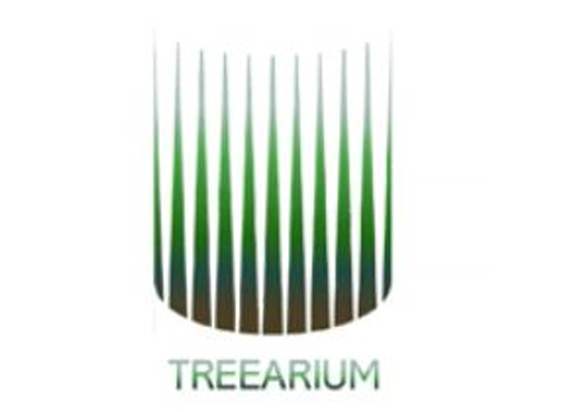
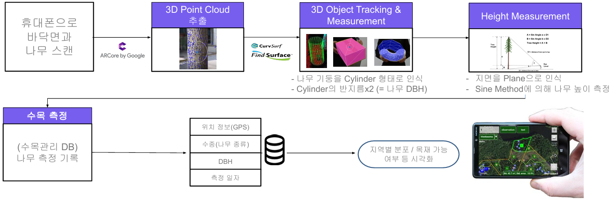

# 🌳 TreeARium

🏆 제7회 ICT 스마트 디바이스 공모전 일반부문 우수상

        

> 모바일 증강현실(AR) 기술을 활용한 차세대 산림자원 측정 및 관리 플랫폼

## 📖 Overview

TreeARium은 스마트폰의 AR(증강현실) 기술을 활용하여 나무의 흉고직경(DBH, Diameter at Breast Height)과 높이를 측정하고, 측정 데이터를 데이터베이스에 저장하여 시각화 및 관리할 수 있는 Smart Forest 솔루션입니다.

기존 산림 측정 방식은 줄자, 윤척, 측고기 등 수작업에 의존하거나 고가의 LiDAR 장비를 필요로 합니다. TreeARium은 별도의 장비 없이 스마트폰만으로 산림 데이터를 쉽고 빠르게 측정할 수 있도록 설계되었습니다.

---

## 👥 Team

| Name | Role |
|--------|--------|
| 채서영 | Team Leader, AR Engine, 3D Object Detection & Measurement |
| 최재경 | AR Engine, 3D Object Detection & Measurement |
| 박성빈 | 3D Rendering |
| 황준용 | App GUI Development, Database Management |
| 이정혁 | App GUI Development, Database Management |
| 양세중 | Forest Measurement Data Plug-in Development |

---

## 🎯 Motivation

기후변화와 산림재해 대응을 위해 전 세계적으로 Smart Forest 사업이 확대되고 있으며, 국내에서도 디지털 산림경영 기반 구축이 추진되고 있습니다. TreeARium은 이러한 흐름에 맞춰 산림 데이터 측정과 관리를 디지털화하는 것을 목표로 합니다. 

### 해결하고자 한 문제

- 산림자원 측정의 높은 인력·시간 비용
- 수작업 기반 데이터 수집 과정
- 실시간 데이터 관리의 어려움
- 고가 장비(LiDAR) 의존성
- 지역별 산림자원 현황 파악의 한계

---

## 🛠 Tech Stack

### Mobile

- Android
- Java
- Android SDK
- ARCore

### Computer Vision & AR

- ARCore by Google
- 3D Point Cloud Extraction
- 3D Object Detection
- Object Tracking
- Surface Detection
- Cylinder Detection
- Height Measurement Algorithm

### Data & Backend

- Firebase Realtime Database
- Cloud Database
- GPS Location Service
- Geospatial Data Management

### Visualization

- Google Maps
- Map View
- Tree Distribution Visualization
- Forest Statistics Dashboard

### Forest Resource Analysis

- DBH (Diameter at Breast Height) Measurement
- Tree Height Estimation
- Tree Species Classification
- Forest Resource Mapping

---

## ✨ Key Features

### 1. AR 기반 나무 DBH 측정

- 나무 기둥을 Cylinder 형태로 인식
- CurvSurf 3D Object Detection & Measurement 기술 적용
- 흉고직경(DBH) 자동 계산
- 평균 오차율 약 5.2%

### 2. AR 기반 나무 높이 측정

- 바닥면(Plane) 자동 인식
- Sine Method 기반 높이 계산
- 카메라 스캔을 통한 자동 측정

### 3. 실시간 산림 데이터 관리

- GPS 기반 위치 저장
- 수종 정보 관리
- 측정 결과 저장
- Cloud Database 연동

### 4. 지도 기반 시각화

- 수목 위치 표시
- 수종별 분포 분석
- 구역별 산림자원 관리
- 목재 활용 가능 자원 탐색

---

## 🚀 What Makes TreeARium Different?

Unlike conventional forest measurement solutions that require
manual measurement tools or expensive LiDAR devices,
TreeARium leverages the CurvSurf FindSurface SDK and ARCore
to recognize tree trunks as 3D cylinders directly from a
smartphone camera.

This enables:

- Accurate DBH measurement without external equipment
- Real-time 3D object detection and measurement
- On-device AR-based forest inventory collection
- Immediate visualization and cloud synchronization

---

## 🏗 System Architecture

        

TreeARium은 ARCore와 CurvSurf FindSurface SDK를 활용하여 스마트폰 카메라 입력으로부터 3차원 포인트 클라우드(Point Cloud)를 생성하고, 이를 기반으로 나무의 흉고직경(DBH), 높이, 수종을 인식합니다.
수집된 데이터는 FireBase 데이터베이스에 저장되며, 지도 기반 시각화와 산림자원 분석 기능을 통해 효율적인 산림 관리 및 의사결정을 지원합니다.

---

## 🌟 TreeARium의 기능

- **산림자원 측정** : AR 기반 DBH 측정, 나무 높이 자동 측정, 실시간 3D 렌더링
- **데이터 관리** : GPS 기반 위치 저장, Cloud Database 연동, 측정 이력 관리
- **시각화 및 분석** : 지도 기반 수목 시각화, 수종별 분포 분석, 통계 대시보드
- **검색 및 분류** : 수목 검색, 수종 분류, 목재 활용 가능 수목 탐색
- **사용자 경험** : 로그인, 뉴스 피드, 직관적인 UI/UX, 실시간 결과 확인

---

## 📊 Performance

| Tree | Ground Truth (cm) | TreeARium (cm) | Error |
|--------|--------|--------|--------|
| Tree 1 | 21.3 | 22.2 | 4.2% |
| Tree 2 | 17.6 | 18.9 | 7.4% |
| Tree 3 | 16.24 | 17.2 | 5.9% |
| Tree 4 | 17.54 | 17.8 | 1.5% |
| Tree 5 | 22.0 | 23.6 | 7.3% |

**Average Error Rate: 5.2%**

---

## 📱 Application Features

- 회원별 산림 데이터 관리
- AR 기반 실시간 DBH 측정
- 실시간 렌더링
- 데이터 저장 및 시각화
- 수목 위치 지도 표시
- 산림 뉴스 제공
- 수종별 통계 분석
- 나무 검색 및 분류
- 수고(높이) 측정

---

## 🌲 Expected Impact

### Digital Forest Management

- 디지털 기반 산림자원 측정 자동화
- 인력 및 시간 비용 절감
- 비대면 산림 데이터 수집

### Forest Resource Analytics

- 지역별 산림자원 분포 시각화
- 실시간 데이터 기반 의사결정 지원
- 산림자원 관리 효율 향상

### Smart Forest Ecosystem

- 산림 데이터 플랫폼 구축
- 목재 자원 관리 지원
- Smart Forest 생태계 확장 가능

---
